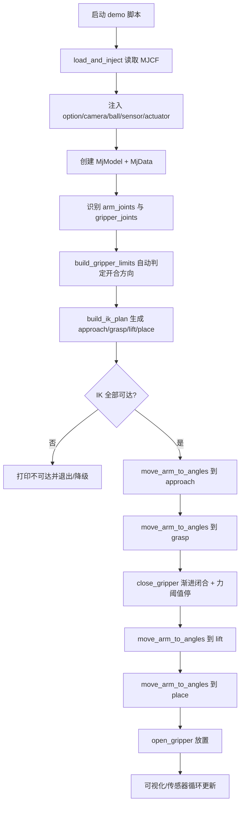

# examples 目录代码全链路深度解析（MuJoCo / PyBullet）

> 目标：把 `examples/` 下的“抓取演示”从**入口脚本**、**模型注入**、**运动学求解**、**轨迹生成**、**接触与力反馈**到**视觉渲染**完整讲清楚。既讲专业术语，也讲直观理解。

---

## 1. 代码分层与主链路

`examples/` 可以抽象成四层：

1. **场景层（Scene）**：加载机械臂模型、往 XML 注入球/传感器/相机/执行器。  
2. **规划层（Planning）**：用 IK 计算“靠近→抓取→抬升→放置”的关键姿态。  
3. **控制层（Control）**：用平滑插值发关节目标；夹爪渐进闭合并依据力阈值停止。  
4. **感知层（Perception）**：读力/力矩与触觉，做低通滤波，显示曲线；相机显示 RGB/RGB-D。

其中最“模块化”的主链路在：
- `examples/common/model_loader.py`
- `examples/common/ik_solver.py`
- `examples/common/motion.py`
- `examples/common/force_sensor.py`
- `examples/common/camera.py`

而 `examples/complete_grasping_demo_mujoco.py` 是“单文件整合版”（很多逻辑与 common 模块同源）。

---

## 2. 运行流程总览（时序图）

直白说：**先把世界搭出来，再算四个关键点，再按顺序走点，并在抓取时用力传感器“刹车”。**

---

## 3. 模型注入层：为什么“运行时改 XML”

关键代码：`examples/common/model_loader.py`

### 3.1 注入算法说明

- `inject_options`：若没有 `<option>`，补上 `integrator="implicitfast" cone="elliptic"`。  
  - 含义：更稳定的隐式积分器 + 椭圆摩擦锥。
- `inject_overview_camera`：给世界增加固定俯视相机。  
- `inject_soft_ball`：插入带 `freejoint` 的球体，设置摩擦/接触参数。  
- `inject_wrist_camera`：在腕部插入 `wrist_rgb` 相机。  
- `inject_force_sensor`：在腕部 site 插入 `force/torque` 传感器。  
- `inject_actuators`：如果没有执行器，则插入 position actuator（每个关节一个）。

### 3.2 设计优点

- **不污染原模型**：原始 `synriard/mjcf/*.xml` 不改，demo 元素全在运行时拼接。  
- **可重配置**：通过 `include_ball/include_sensors/include_camera` 快速切场景。  
- **便于实验对比**：只改注入开关即可做 ablation。

### 3.3 局限

- 字符串替换依赖“标记片段存在”（比如某个 geom 文本），对模型版本变化敏感。  
- 更工程化的做法是 XML DOM 解析或 MJCF API 构造，鲁棒性更高。

---

## 4. IK（逆运动学）核心：阻尼最小二乘 DLS

关键代码：`examples/common/ik_solver.py`

### 4.1 求解对象

不是直接对 tool 点做 IK，而是对**两指中点**：
\[
\mathbf{p}_c = \frac{\mathbf{p}_L + \mathbf{p}_R}{2}
\]

这能让抓取动作更“以夹爪中心为目标”，避免单指对齐导致偏抓。

### 4.2 雅可比构造

通过 `mj_jacBody` 求左右指位置雅可比：
\[
\mathbf{J}_c = \frac{\mathbf{J}_L + \mathbf{J}_R}{2}
\]

误差定义：
\[
\mathbf{e}_p = \mathbf{p}_{target} - \mathbf{p}_c
\]

### 4.3 DLS 更新（位置版）

代码对应：
\[
\Delta \mathbf{q} = \mathbf{J}^T(\mathbf{J}\mathbf{J}^T + \lambda \mathbf{I})^{-1}\mathbf{e}_p
\]

- `\lambda` 是阻尼项（代码里 `lam=0.025`），抑制奇异位形附近发散。
- `delta_q` 再被裁剪到 `[-0.08, 0.08]`，防止步长过大。
- 最后 `q <- clip(q + step_size * delta_q, lower, upper)` 保证关节限位。

### 4.4 姿态误差（扩展版）

若传入 `target_xmat`，会联合位置+姿态：

姿态小角误差（世界系）近似：
\[
\mathbf{e}_R = \frac{1}{2}\sum_{i=1}^{3}(\mathbf{r}_i \times \mathbf{r}_i^*)
\]

整体最小二乘：
\[
\min_{\Delta \mathbf{q}}\left\|\begin{bmatrix}
\mathbf{J}_p\\
 w_R\mathbf{J}_R
\end{bmatrix}\Delta \mathbf{q}-
\begin{bmatrix}
\mathbf{e}_p\\
 w_R\mathbf{e}_R
\end{bmatrix}\right\|^2+\lambda\|\Delta\mathbf{q}\|^2
\]

代码中还支持 `rest_angles` 正则，把解往“舒适姿态”拉。

### 4.5 优缺点

**优点**
- DLS 计算快、稳定、易实时。  
- 中点 IK 与夹爪任务高度匹配。  
- 支持 joint limit / 姿态权重 / rest regularization。

**缺点**
- 属于局部迭代法，强依赖初值；可能陷入局部可达。  
- 没显式考虑碰撞约束（只是几何可达，不保证无碰撞）。  
- 多目标权重（位置 vs 姿态）需要经验调参。

---

## 5. 抓取计划：离线关键帧 IK 串联

关键代码：`build_ik_plan`（`ik_solver.py`）

默认目标点：
- `approach = ball + [0,0,0.15]`
- `grasp = ball + [0,0,0.6R]`
- `lift = grasp + [0,0,0.20]`
- `place = [0.45,0.15,0.20]`

算法思想是“**分段点到点**”：每算出一个点，就把该解作为下一点 seed。  
这本质是 warm-start continuation，可显著提高后续收敛率。

缺点是仍然是“几何点串联”，没有全局时间最优或碰撞最优（不是 TrajOpt/CHOMP）。

---

## 6. 轨迹生成：余弦插值（ease-in/ease-out）

关键代码：`examples/common/motion.py::move_arm_to_angles`

插值核：
\[
s(t)=\frac{1-\cos(\pi t)}{2},\quad t\in[0,1]
\]
\[
\mathbf{q}(t)=\mathbf{q}_0+s(t)(\mathbf{q}_1-\mathbf{q}_0)
\]

直观解释：开始慢、中间快、结束慢，减少突变。  
对位置伺服器来说，这比线性插值更不容易激发振荡。

### 优点
- 简单稳定，工程上常用。
- 速度边界平滑（端点速度接近 0）。

### 不足
- 不是动力学最优（未显式最小 jerk/torque）。
- 若路径穿越障碍，插值本身不会避障。

---

## 7. 夹爪闭合与接触判定：阈值停止策略

关键代码：`close_gripper`（`motion.py`）

流程：
1. 夹爪目标从 open→closed 线性推进。  
2. 每步读取 `actuator_force` 的绝对值最大值。  
3. 超过阈值 `force_threshold` 即停止并判定“抓到/触碰到”。

这是典型的**力控近似策略**（位置控制+力阈值守护），比“直接一下夹死”更稳。

### 优点
- 实现成本低，不需要完整阻抗控制框架。  
- 对未知软硬物体都能给出“接触即停”的保护。

### 缺点
- 只用单阈值，无法精细区分“稳抓”与“轻碰”。  
- 阈值对模型质量/摩擦/时间步敏感，需要调参。

---

## 8. 力/触觉传感器：指数低通滤波

关键代码：`examples/common/force_sensor.py`

滤波更新：
\[
\mathbf{y}_k = \mathbf{y}_{k-1} + \alpha(\mathbf{x}_k-\mathbf{y}_{k-1})
\]

- `x_k` 原始传感器值
- `y_k` 滤波后值
- `\alpha\in[0,1]`

直观：`\alpha` 越小越平滑但延迟更大；越大越灵敏但更抖。

### 为什么需要滤波
MuJoCo 接触解算的瞬时力会有高频抖动（contact chatter），直接显示会“跳字”。低通后更接近真实采样传感器观感。

### 触觉力提取
如果触觉传感器是向量，取范数：
\[
F = \|\mathbf{f}\|_2
\]

并定义左右平衡指标：
\[
\text{balance}=\frac{|F_L-F_R|}{F_L+F_R+\epsilon}
\]

可用于判断是否“偏夹”。

---

## 9. 相机管线：RGB 与 RGB-D 对齐渲染

关键代码：`examples/common/camera.py`

`RGBDCameraWindow.render_rgbd` 的做法是：
1. 同一相机位姿渲染 RGB；
2. 切换 renderer 深度模式再渲染 depth；
3. 深度图做百分位归一化 + colormap。

深度归一化核心：
\[
D_{norm}=\text{clip}\left(\frac{D-D_{near}}{D_{far}-D_{near}},0,1\right)
\]
其中 `near/far` 取有效深度的 3%/97% 分位，避免极端值把对比度拉坏。

---

## 10. PyBullet 版本与 MuJoCo 版本的算法对照

- `examples/complete_grasping_demo.py`（PyBullet）也用 IK + 平滑插值 + 力反馈停夹，但 IK 求解器由 `p.calculateInverseKinematics` 提供。  
- `examples/complete_grasping_demo_mujoco.py` 将同类逻辑内联在单文件中，便于“一个脚本跑通”。

### 差异理解
- MuJoCo 版更强调“自行可控”的数值细节（自己写 DLS IK）。
- PyBullet 版更偏“调 API 快速验证”。

---

## 11. 关键参数敏感性（调参指南）

1. **IK 阻尼 `lam`**：大→更稳但更慢；小→更快但易抖/奇异。  
2. **`step_size` 与 `delta_q` clip**：大步长可能快但易越界；clip 太小会收敛慢。  
3. **`force_threshold`**：过低会“误停”，过高会“挤压过头”。  
4. **滤波 `alpha`**：展示/监测建议 0.2~0.4；控制闭环若用滤波力，要注意延迟。  
5. **SLEEP_SCALE**：只影响墙钟速度与观感，不改仿真物理步长（前提是仍每步 `mj_step`）。

---

## 12. 可改进点（工程升级路线）

- 从点到点升级到**时间参数化轨迹**（如 minimum-jerk / TOPP）。
- 把 grasp 判定从单阈值升级为“力+触觉平衡+相对运动”联合判据。
- 在 IK 中加入碰撞约束（优化器 + signed distance）。
- XML 注入改为结构化 MJCF 构造，减少字符串脆弱性。

---

## 13. 一句话总结

这套 examples 的核心算法组合是：  
**DLS 逆运动学 + 余弦平滑轨迹 + 力阈值闭合 + 低通滤波感知 + 运行时场景注入**。  
它不是最“学术最优”的全局规划器，但在工程上具有**可解释、易调试、实时友好**的优点，非常适合演示与教学。
